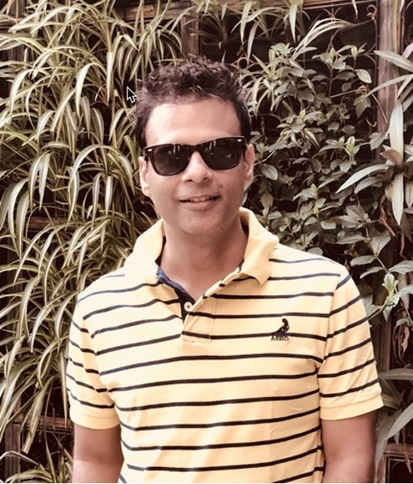

## Vaibhav Mehta (VB)
#### Senior Technical Consultant

----
-----
# About Me
Senior Technical Consultant with 21 years of total IT experience. Major part of his  Career worked with Fusionstorm/Computacenter 

SME on EMC/Dell Storage Backup & Disaster Recovery Solution’s 

I also got an opportunity at SunGard to Play a Lead Technical Architect role in Cloud Product Development team where I  designed EMC VNX Storage (BLOCK & FILE) in Multitenancy mode using Recover Point 

---
# My Driving Force
### Driving force - Technology 

### Reason – I started Career at Helpdesk Engineer, but in my journey I got opportunity to work all different technology EMC VMware Backup Cisco & Cloud.

----
# My thoughts on opportunities and challenges

### I consider all Challanges are opportunity to demonstrate and develop

## **_whenever there is a challenge there is also an opportunity to face it , to demonstrate and develop our will and determination **_	- Dalai Lama

### Standard Charter – Switch Migration success story

---

# Last 12 months Achievements & Impact on Business
#### I had been taking care of some key Accounts
- #### MLB
- #### Brixmor
- #### Fanduel 
### I added one more key accounts to my profile 
- ####  Roblox
  ### Impact – I play small role with help of an amazing team, but it has a bigger impact on business 
---

# Top professional accomplishment in the last 12 months

## HYCU on job training
## MLB – Avamar to HYCU migration
## Managing MLB HYCU Environment along with team
## Roblox PMV's every week 

---
#   Value added to the business over the last 12 months

## “We see our customer as invited guest to a party , and we are the hosts. Its is our job to make the customer experience a little bit better” -- Jeff Bezos

### There is direct relation of customer to business, being consistent Productive and supportive team member , our team ensure to keep our customer happy, which eventually got all the key customer's contract renewed for next 12 months

---

## What worked well, what didn’t work well, what would you do differently, and how do you think this would alter the outcome?

## I learned HYCU backup software and helped MLB with migration.

## This year , I would try to focus on getting certification , I tried it last year to appear for AWS and got off track. I would stay focus this year and achieve at least 1-2 certification. 

---

  #                                   Thank You

